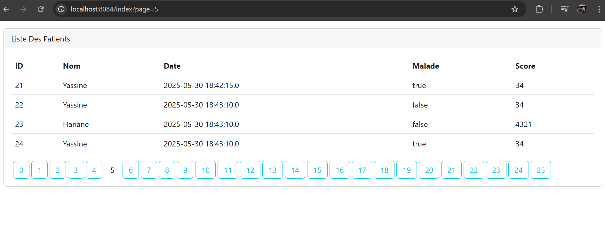

# hopital_MVC
#  TP 3

## Partie 1  Gestion des Patients avec Spring Boot, Thymeleaf et Spring Data JPA


---

## Objectif du Partie 1

Créer une application Web JEE basée sur :
- **Spring MVC**
- **Thymeleaf**
- **Spring Data JPA**


##  Intoducyion
Ce rapport parle de la création d’une application web avec Java. On a utilisé Spring MVC pour organiser le code, Thymeleaf pour faire les pages web, et Spring Data JPA pour gérer les données. L’application permet de faire des actions classiques (comme ajouter, modifier, supprimer), mais aussi des choses un peu plus avancées, comme chercher facilement, afficher les résultats page par page, vérifier les formulaires, et sécuriser l’accès avec Spring Security.
L’interface permet :
- d'afficher les patients dans un tableau,
- de chercher par nom via un champ de recherche,
- de paginer dynamiquement,
- d’ajouter, modifier ou supprimer un patient.

**1. Création de l'entité `Patient`**

##  Interface & Fonctionnalités
Nous avons créé l’entité Patient en utilisant les annotations JPA telles que @Entity, @AllArgsConstructor, @NoArgsConstructor et @Builder afin de faciliter la gestion des données et la génération automatique de constructeurs. Par la suite, nous avons implémenté le code nécessaire pour ajouter des patients à la base de données. Enfin, l'application a été connectée à une base de données SQL via XAMPP, permettant ainsi la persistance effective des données.
### Test de base


---
### Connexion à la base de données H2/MySQL


---

### Le MVC SPROING
Spring MVC (Model-View-Controller) est un framework de Spring qui permet de créer des applications web structurées. Il sépare l’application en trois parties :

- Model : gère les données et la logique métier.
- View : affiche les données à l’utilisateur (ex. avec Thymeleaf).
- Controller : reçoit les requêtes de l’utilisateur, appelle le modèle, et renvoie la vue.

Ce découpage rend le code plus clair, organisé et facile à maintenir.
Affichage de l'index
Dans la classe PatientController, nous avons défini une méthode index() associée à la route /index à l'aide de l'annotation @GetMapping. Cette méthode permet de gérer l'affichage de la liste des patients. Elle utilise le repository pour rechercher les patients dont le nom contient un mot-clé donné (keyword), avec prise en charge de la pagination. Les résultats sont ensuite envoyés vers la vue patients.html, qui se trouve dans le dossier des templates.
Ensuite, nous avons effectué un test sur le serveur afin de vérifier le bon fonctionnement de la méthode index() et s'assurer que les données des patients sont correctement affichées dans la vue patients.html, avec prise en charge de la recherche et de la pagination.


---

###  Table des patients (`index`)


Après avoir vérifié le bon fonctionnement de l'application, nous avons affiché la liste complète des patients en utilisant la méthode findAll() du PatientRepository. Cette opération a été réalisée dans le contrôleur PatientController, où les résultats ont été ajoutés au modèle sous forme d'attributs afin qu’ils puissent être affichés dans la vue patients.html lors de la redirection.


---

### Dépendance Bootstrap (style)
Pour utiliser les styles de Bootstrap, nous avons importé les dépendances nécessaires dans le fichier pom.xml à partir du web. Ensuite, nous avons ajouté un lien (<link>) vers la feuille de style Bootstrap dans le fichier HTML, ce qui nous a permis d’utiliser facilement ses classes pour améliorer l’apparence de l’interface utilisateur.


---


### Pagination : 

- La pagination permet d’afficher les résultats d’une requête (par exemple une liste de patients) page par page au lieu de tout afficher d’un coup. Cela améliore les performances et l’expérience utilisateur.

- Contrôleur avec pagination: dans le contrôleur, on utilise PageRequest.of(page, size) pour définir la page actuelle et le nombre d’éléments par page.
```
public String index(Model model,
                        @RequestParam(name = "page",defaultValue="0") int p,
                        @RequestParam(name="size",defaultValue="4") int s,
                        @RequestParam(name="keyword",defaultValue="") String kw) {

        Page<Patient> pagePatients = pateintRepository.findByNomContains(kw,PageRequest.of(p,s));
        //Page<Patient> pagePatients = pateintRepository.findAll(PageRequest.of(p,s));
        model.addAttribute("patientList",pagePatients.getContent());
        model.addAttribute("currentPages",p);
        model.addAttribute("keyword",kw);
        //Avoir le nombre total des pages
        model.addAttribute("pages",new int[pagePatients.getTotalPages()]);
        return "patients";
```

```angular2html
 <a onclick="javascript: return confirm('Voulez vous supprimer?')"
                           th:href="@{/delete(id=${p.id}, page=${currentPages}, keyword=${keyword})}"
                           class="btn btn-danger">
                             <i class="bi bi-trash"></i>
</a>
<a th:href="@{/editPatient(id=${p.id})}" class="btn btn-warning me-2">
                            <i class="bi bi-pencil-square"></i>
</a>
```
Les patients sont affichés page par page.

On peut naviguer entre les pages avec les boutons générés dynamiquement.

On peut transmettre les valeurs des variables directement dans l’URL en utilisant des paramètres de requête. Par exemple :
```
http://localhost:8084/index?page=0&size=3

```


---

###  Écran de pagination entre les pages 


---

### Code de la pagination
Pour permettre la recherche d’un patient par nom, nous avons ajouté une barre de recherche dans la vue patients.html. Elle contient un champ de saisie et un bouton de soumission 


---

                

Ensuite, nous avons défini une méthode dans le contrôleur PatientController qui prend en compte les paramètres keyword, page et size pour effectuer la recherche tout en conservant la pagination:

```
    Page<Patient> pagePatients = patientRepository.findByNomContains(keyword, PageRequest.of(page, size));

```


### Formulaire de recherche


---

### Résultats paginés avec recherche


### Suppression d’un patient
Pour supprimer un patient, on crée une méthode dans le contrôleur dédiée à cette opération :
``` @GetMapping("/delete")
    public String delete(Long id,int page,String keyword) {
        pateintRepository.deleteById(id);
        return "redirect:/index?page="+page+"&keyword="+keyword ;
    }
```
Ensuite, dans le fichier patients.html, on ajoute un bouton de suppression dans le tableau des patients :
``` 
<a onclick="javascript: return confirm('Voulez vous supprimer?')"
                           th:href="@{/delete(id=${p.id}, page=${currentPages}, keyword=${keyword})}"
                           class="btn btn-danger">
<i class="bi bi-trash"></i>
</a>
```


---

###  Ajouter /  Modifier un patient

Pour ajouter ou modifier un patient, nous créons deux méthodes dans le contrôleur : l’une pour afficher le formulaire d’ajout/modification, et l’autre pour sauvegarder les données en base.

Dans la vue patients.html, on ajoute des boutons qui redirigent vers le formulaire formPatient.html. Ce formulaire permet de saisir ou modifier les informations du patient.
```
<!DOCTYPE html>
<html xmlns:th="http://www.thymeleaf.org" lang="en">
<head>
    <meta charset="UTF-8">
    <title>Formulaire Patient</title>
    <link rel="stylesheet" href="/webjars/bootstrap/5.2.3/css/bootstrap.min.css">
</head>
<body>
<div class="container mt-4">
    <div class="card">
        <div class="card-header">Ajouter / Modifier un Patient</div>
        <div class="card-body">
            <form method="post" th:action="@{/savePatient}" th:object="${patient}">
                <input type="hidden" th:field="*{id}"/>
                
                <div class="mb-3">
                    <label>Nom :</label>
                    <input class="form-control" th:field="*{nom}" required/>
                </div>
                
                <div class="mb-3">
                    <label>Date de naissance :</label>
                    <input type="date" class="form-control" th:field="*{dateNaissance}" required/>
                </div>
                
                <div class="mb-3">
                    <label>Score :</label>
                    <input type="number" class="form-control" th:field="*{score}" required/>
                </div>
                
                <div class="mb-3 form-check">
                    <input type="checkbox" class="form-check-input" th:field="*{malade}"/>
                    <label class="form-check-label">Malade</label>
                </div>
                
                <button type="submit" class="btn btn-primary">Enregistrer</button>
                <a th:href="@{/index}" class="btn btn-secondary">Annuler</a>
            </form>
        </div>
    </div>
</div>
</body>
</html>

```

## Résultat

Toutes les fonctionnalités demandées ont été réalisées avec succès.  
Des améliorations ont également été apportées à l’ergonomie et à l’expérience utilisateur.


---


## Partie 2  Gestion des Patients avec Spring Boot, Thymeleaf et Spring Data JPA

## Objectif du Partie 2

- Créer une page template
- Faire la validation des formulaires


### Créer une page template
 Pour intégrer un système de templates réutilisables (layout) dans une application web utilisant Thymeleaf, il est nécessaire d'importer la dépendance correspondante, à savoir thymeleaf-layout-dialect, puis de l'ajouter dans le fichier de configuration pom.xml. Cette bibliothèque permet de définir une structure de page commune (en-tête, pied de page, menu, etc.) afin de favoriser la réutilisabilité et la cohérence de l’interface utilisateur.

nous avons conçu une page modèle, communément appelée template, qui servira de structure de base pour toutes les autres pages de l’application. Ce template centralise les éléments communs tels que la mise en page, les styles, et la navigation, permettant ainsi une cohérence visuelle et fonctionnelle sur l’ensemble du site. L’utilisation d’un template favorise également la réutilisation du code, ce qui facilite la maintenance et les évolutions futures du projet. Pour intégrer ce template dans les différentes pages, nous appliquons un mécanisme d’héritage spécifique, mis en œuvre grâce au code suivant, qui permet aux pages filles de se baser sur cette structure commune tout en personnalisant leur contenu propre.
   


### Faire la validation des formulaires

Pour activer la validation, il est nécessaire d'importer les dépendances correspondantes à la validation dans Spring Boot.


## Réalisé par

**Aamer Fadma**  
Étudiante en Master – Data Science & Intelligence Artificielle  
Université Moulay Ismail – Faculté des Sciences  
Année universitaire : 2024/2025
